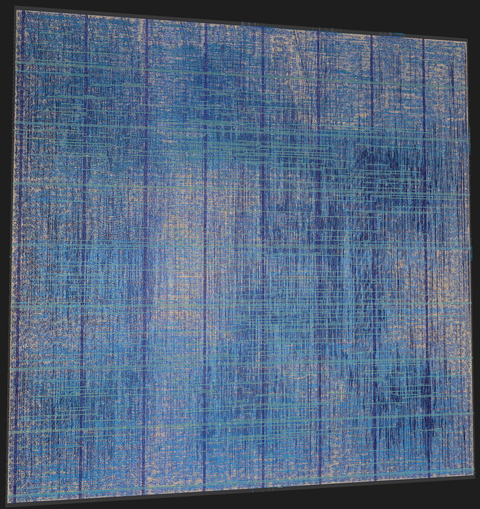

# kGPU

kGPU is a very simplistic SIMT GPU architecture. It is built in system verilog and synthesized through the [librelane](https://github.com/librelane/librelane) synthesis flow. kGPU comes fully featured with a warp scheduler to interleave warps and supports branch reconvergence.

kGPU supports executing arbitrary kernels via cocotb in python. There are currently 2 kernels in gpu_testbench.py, one that does not branch and one that diverges.



### Table of Contents

- [Description](#description)
  - [Tooling/Workflow](#toolingworkflow)
    - [Simulation](#simulation)
    - [Verification](#verification)
    - [Synthesis](#synthesis)
- [Architecture](#architecture)
  - [Instruction Set](#instruction-set)
  - [Hardware](#hardware)
    - [Dispatcher](#dispatcher)
    - [Streaming Multiprocessor (SM)](#streaming-multiprocessor-sm)
    - [Warp Scheduler](#warp-scheduler)
    - [Warps and Branch Reconvergence](#warps-and-branch-reconvergence)
    - [Lanes](#lanes)
    - [Register File](#register-file)
    - [Load/Store Unit](#loadstore-unit)
    - [Memory](#memory)
- [Kernels](#kernels)
    - [add_const](#add_const)
    - [diverge](#diverge)
- [Future Works](#future-works)
- [Credits](#credits)


# Description

There are a few good resources out there for learning the architecture of GPUs but very few for the goal I was trying to reach. I wanted to try and cover some modern abstraction while keeping the SM simple and lightweight. Here is a run through of the architecture of the GPU and all of the details that went in to it

## Tooling/Workflow

### Simulation

The majority of the project is dominated by SystemVerilog and Verilator. I chose Verilator as the compiler due to its simple 2 state simulator design (0, 1) rather than four states (0, 1, X, Z). I had no use for the extra Unknown, and High Impedance values so I opted for the less strict 2 state simulator. 

To run the simulation install dependencies:

```sh
sudo apt-get update
sudo apt-get upgrade
sudo apt-get install git help2man perl python3 make autoconf g++ flex bison ccache libgoogle-perftools-dev libjemalloc-dev numactl perl-doc libfl2 libfl-dev zlibc zlib1g zlib1g-dev liblz4 liblz4-dev   
```

Clone and build Verilator:

```sh
git clone https://github.com/verilator/verilator
cd verilator
unset VERILATOR_ROOT
autoconf
./configure
make -j `nproc`
sudo make install
```

Then install cocotb:

```sh
pip install cocotb
```

And finally run the simulation

```sh
cd kGPU/Testbenches/
make
```

### Verification

For me python was the go to language for verification of functionality. I liked the implementation of cocotb as the arbiter due to its flexibility and writability. I based my configuration off of [tiny-gpu](https://github.com/adam-maj/tiny-gpu) using cocotb to interface with the gpu to schedule kernels and manage the off chip memory that the hardware communicates with. This gave me an easy workflow for compiling and simulate using Makefile and Verilator. It drastically simplified the steps without sacrificing efficiency or correctness.

### Synthesis

The RTL &rarr; GDSII pipeline was satisfied by [librelane](https://github.com/librelane/librelane). This includes [yosys](https://github.com/yosyshq/yosys) for gate-level netlist synthesis, [OpenROAD](https://github.com/The-OpenROAD-Project/OpenROAD) for PnR, [Magic](https://opencircuitdesign.com/magic/) and [KLayout](https://www.klayout.de/) for physical verification, and [Netgen](https://opencircuitdesign.com/netgen/) for netlist comparison. The specs were kept to 1 SM, 2 warps, and 8 threads per warp to keep the PPA within reasonable limits for a personal project.  

# Architecture

kGPU is built bottom up as **GPU → Dispatcher → SM → Warps/Lanes**. Everything is parameterized, so the same RTL can scale from my small synthesied config up to something closer to a real part.

## Instruction Set

kGPU uses a fixed 32-bit instruction width. The below tables describes all operations:

| $\textsf{\color{white}Opcode}$ | $\textsf{\color{white}Function}$                                                                                                   | $\textsf{\color{white}Structure}$                                                                                                                         |
|:------------------------------:|:----------------------------------------------------------------------------------------------------------------------------------:|:---------------------------------------------------------------------------------------------------------------------------------------------------------:|
| $\textsf{\color{white}NOP}$    | $\textsf{\color{white}PC = PC + 1}$                                                                                                | $\textsf{\color{white}000000}$ $\textsf{\color{gray}xxxxx}$ $\textsf{\color{gray}xxxxx}$ $\textsf{\color{gray}xxxxxxxxxxxxxxxx}$                          |
| $\textsf{\color{white}ADD}$    | $\textsf{\color{red}Rd}$ $\textsf{\color{white}=}$ $\textsf{\color{teal}Rs}$ $\textsf{\color{white}+}$ $\textsf{\color{yellow}Rt}$ | $\textsf{\color{white}000001}$ $\textsf{\color{teal}sssss}$ $\textsf{\color{yellow}ttttt}$ $\textsf{\color{red}ddddd}$ $\textsf{\color{gray}xxxxxxxxxxx}$ |
| $\textsf{\color{white}SUB}$    | $\textsf{\color{red}Rd}$ $\textsf{\color{white}=}$ $\textsf{\color{teal}Rs}$ $\textsf{\color{white}-}$ $\textsf{\color{yellow}Rt}$ | $\textsf{\color{white}000010}$ $\textsf{\color{teal}sssss}$ $\textsf{\color{yellow}ttttt}$ $\textsf{\color{red}ddddd}$ $\textsf{\color{gray}xxxxxxxxxxx}$ |
| $\textsf{\color{white}MUL}$    | $\textsf{\color{red}Rd}$ $\textsf{\color{white}=}$ $\textsf{\color{teal}Rs}$ $\textsf{\color{white}*}$ $\textsf{\color{yellow}Rt}$ | $\textsf{\color{white}000011}$ $\textsf{\color{teal}sssss}$ $\textsf{\color{yellow}ttttt}$ $\textsf{\color{red}ddddd}$ $\textsf{\color{gray}xxxxxxxxxxx}$ |
| $\textsf{\color{white}DIV}$    | $\textsf{\color{red}Rd}$ $\textsf{\color{white}=}$ $\textsf{\color{teal}Rs}$ $\textsf{\color{white}/}$ $\textsf{\color{yellow}Rt}$ | $\textsf{\color{white}000100}$ $\textsf{\color{teal}sssss}$ $\textsf{\color{yellow}ttttt}$ $\textsf{\color{red}ddddd}$ $\textsf{\color{gray}xxxxxxxxxxx}$ |
| $\textsf{\color{white}STR}$    | $\textsf{\color{white}Mem[\color{yellow}Rt\color{white}] = \color{teal}Rs}$                                                        | $\textsf{\color{white}000101}$ $\textsf{\color{teal}sssss}$ $\textsf{\color{yellow}ttttt}$  $\textsf{\color{gray}xxxxxxxxxxxxxxxx}$                       |
| $\textsf{\color{white}LDR}$    | $\textsf{\color{teal}Rs\color{white} =\color{white} Mem[\color{yellow}Rt\color{white}]}$                                           | $\textsf{\color{white}000110}$ $\textsf{\color{teal}sssss}$ $\textsf{\color{yellow}ttttt}$  $\textsf{\color{gray}xxxxxxxxxxxxxxxx}$                       |
| $\textsf{\color{white}RET}$    | $\textsf{\color{gray}finished}$                                                                                                    | $\textsf{\color{white}000111}$ $\textsf{\color{gray}xxxxxxxxxxxxxxxxxxxxxxxxxx}$                                                                          |
| $\textsf{\color{white}MOV}$    | $\textsf{\color{teal}Rs \color{white}= \color{orange}IMM16}$                                                                       | $\textsf{\color{white}001000}$ $\textsf{\color{teal}sssss}$ $\textsf{\color{gray}xxxxx}$  $\textsf{\color{orange}iiiiiiiiiiiiiiii}$                       |
| $\textsf{\color{white}BEQ}$    | $\textsf{\color{teal}Rs \color{white}== \color{yellow}Rt \color{white} → PC = \color{orange}IMM16}$                                | $\textsf{\color{white}001001}$ $\textsf{\color{teal}sssss}$ $\textsf{\color{yellow}ttttt}$  $\textsf{\color{orange}iiiiiiiiiiiiiiii}$                     |
| $\textsf{\color{white}BNE}$    | $\textsf{\color{teal}Rs \color{white}!= \color{yellow}Rt \color{white} → PC = \color{orange}IMM16}$                                | $\textsf{\color{white}001010}$ $\textsf{\color{teal}sssss}$ $\textsf{\color{yellow}ttttt}$  $\textsf{\color{orange}iiiiiiiiiiiiiiii}$                     |
| $\textsf{\color{white}BLT}$    | $\textsf{\color{teal}Rs \color{white}< \color{yellow}Rt \color{white} → PC = \color{orange}IMM16}$                                 | $\textsf{\color{white}001011}$ $\textsf{\color{teal}sssss}$ $\textsf{\color{yellow}ttttt}$  $\textsf{\color{orange}iiiiiiiiiiiiiiii}$                     |
| $\textsf{\color{white}B}$      | $\textsf{\color{white}PC = \color{orange}IMM16}$                                                                                   | $\textsf{\color{white}001100}$ $\textsf{\color{teal}sssss}$ $\textsf{\color{gray}xxxxx}$  $\textsf{\color{orange}iiiiiiiiiiiiiiii}$                       |

Opcodes are 6 bits wide, Registers are 5 bits wide and the immediate is 16 bits wide as illustrated in the table. When there is an instruction with no immediate, Rd takes the slot from bit 15 down to 11.

ADD → Computes the addition of register Rs and Rt and stores it in register Rd.

SUB → Computes the subtraction of register Rt from Rs and stores it in register Rd.

MUL → Computes the product of register Rs and Rt and stores it in register Rd.

DIV → NON FUNCTIONAL. Removed due to massive synthesis issues (WIP).

NOP → Do nothing and increment PC.

STR → Store Rs in to the global memory address in Rt.

LDR → Load Rs with the data from global memory address Rt.

RET → Kernel has reached the end of its instructions.

MOV → Load register Rs with IMM16

BEQ → Update PC to IMM16 if Rs == Rt.

BNE → Update PC to IMM16 if Rs != Rt.

BLT → Update PC to IMM16 if Rs < Rt.

B → Update PC to IMM16 unconditionally.

## Hardware

<p float="left">
  
  
</p>

### Dispatcher

The dispatcher glues the testbench and the SMs together. The testbench provides the dispatcher with a PC, number of blocks, and `blockDimx` then pulses `start`. The dispatcher looks for the lowest free warp slots across all the SMs and launches the next block in to it. One block maps to one warp now so `blockDimx` cannot exceed the size of the warp (32 threads). The excess are masked off via `thread_enable`. Once every SM reports it is finished kernel execution is stopped via `kernel_done` being raised. 

### Streaming Multiprocessor (SM)

The SM is the most essential part of the design. It instantiates a fetcher, decoder, and a control unit that is common between all of its warps. The SM is multicycled instead of pipelined for simplicity reasons but in the future I plan on pipelining the SM to keep execution cycles low and efficient.

### Warp Scheduler

The warp scheduler is bundled with the `controlunit` and picks the next warp based on the ones that are already finished. If a warp has already finished its execution it will be skipped. 

### Warps and Branch Reconvergence

Each warp has 32 threads which each have their own program counter. This is to combat branch divergence. The warp only executes the lowest PC threads so they can catch up to the threads that are further along so that all threads equalize their PCs again and merge back together. This reconvergence requires no reconvergence stack, however one downside of this crude approach (waiting for diverging PCs) is that if a thread loops, the entire warp has to wait for the thread. 

### Lanes

A lane is essentially a datapath for a thread. It gets its own Register File, ALU, and LSU. All of the lanes get the same decoded instruction however only the active ones (not masked off) write back. The lane evaluates any branch condition and sends it back to the warp so it can update the thread's PC accordingly.

### Register File

Each lane has a single 32 registers  x 16 bit register file. The register file comes preloaded with 3 values:

| Register | Value         |
| -------- | ------------- |
| `r31`    | `blockDim.x`  |
| `r30`    | `blockIdx.x`  |
| `r29`    | `threadIdx.x` |

These allow the kernel to compute the global index for the thread, the same way it would in CUDA.

### Load/Store Unit

Each lane also has its own Load/Store Unit to communicate to and from global memory. This means that each thread can issue its own memory. The SM stays in the WAIT state until every active lane's LSU finishes execution.

### Memory

Instruction memory and data memory are separated. Instruction memory is 32 bits wide due to the 32 bit instruction and has 16 bits of addresses. Data memory is 16 bits wide and also has 16 bits of addresses. They exist in the python testbench and are what the memory controller communicates to from the simulation. They are connected through `memchannelinterface` . The instruction memory serves 1 fetcher per SM while the data memory serves `NUM_SMS` \* `WARP_SIZE` requesters. 

# Kernels

The first kernel is a proof of concept kernel that always converges. It takes the gid of the current thread, multiplies it by 3, and then adds 5 to it and stores it in the global memory address of its thread past the input block:

### add_const

`add_const.asm`

```asm
.blocks 16
.threads 8
.data @256 0 3 6 9 ...         ; input array, in[gid] = gid * 3

MOV R1, #5                     ; constant to add
MOV R7, #256                   ; IN_BASE (input array base address)

MUL R3, %blockIdx, %blockDim
ADD R4, R3, %threadIdx         ; gid = blockIdx * blockDim + threadIdx

ADD R6, R4, R7                 ; addr(in[gid]) = IN_BASE + gid
LDR R5, R6                     ; load in[gid] from global memory

ADD R2, R5, R1                 ; out = in[gid] + 5
STR R2, R4                     ; store out[gid] in global memory

RET                            ; end of kernel
```

`add_const output`

<!-- add_const_results -->

add_const: 16 blocks x 8 threads finished in 2099 cycles

| block | t0  | t1  | t2  | t3  | t4  | t5  | t6  | t7  | result |
| -----:| ---:| ---:| ---:| ---:| ---:| ---:| ---:| ---:|:------:|
| 0     | 5   | 8   | 11  | 14  | 17  | 20  | 23  | 26  | PASS   |
| 1     | 29  | 32  | 35  | 38  | 41  | 44  | 47  | 50  | PASS   |
| 2     | 53  | 56  | 59  | 62  | 65  | 68  | 71  | 74  | PASS   |
| 3     | 77  | 80  | 83  | 86  | 89  | 92  | 95  | 98  | PASS   |
| 4     | 101 | 104 | 107 | 110 | 113 | 116 | 119 | 122 | PASS   |
| 5     | 125 | 128 | 131 | 134 | 137 | 140 | 143 | 146 | PASS   |
| 6     | 149 | 152 | 155 | 158 | 161 | 164 | 167 | 170 | PASS   |
| 7     | 173 | 176 | 179 | 182 | 185 | 188 | 191 | 194 | PASS   |
| 8     | 197 | 200 | 203 | 206 | 209 | 212 | 215 | 218 | PASS   |
| 9     | 221 | 224 | 227 | 230 | 233 | 236 | 239 | 242 | PASS   |
| 10    | 245 | 248 | 251 | 254 | 257 | 260 | 263 | 266 | PASS   |
| 11    | 269 | 272 | 275 | 278 | 281 | 284 | 287 | 290 | PASS   |
| 12    | 293 | 296 | 299 | 302 | 305 | 308 | 311 | 314 | PASS   |
| 13    | 317 | 320 | 323 | 326 | 329 | 332 | 335 | 338 | PASS   |
| 14    | 341 | 344 | 347 | 350 | 353 | 356 | 359 | 362 | PASS   |
| 15    | 365 | 368 | 371 | 374 | 377 | 380 | 383 | 386 | PASS   |

128/128 outputs correct

### diverge

<!-- /add_const_results -->

`diverge.asm`

```asm
.blocks 16
.threads 8

ADD R1, %threadIdx, R0         ; counter = threadIdx (R0 is always 0)
MOV R2, #1                     ; increment
MOV R6, #0                     ; acc = 0

BEQ R1, R0, DONE               ; thread 0 skips the loop

LOOP:
  SUB R1, R1, R2               ; decrement counter
  ADD R6, R6, R2               ; increment acc
  BNE R1, R0, LOOP             ; loop while counter != 0, threads diverge here

DONE:                          ; all threads reconverge here
MUL R3, %blockIdx, %blockDim
ADD R4, R3, %threadIdx         ; gid = blockIdx * blockDim + threadIdx
STR R6, R4                     ; store out[gid] = threadIdx in global memory

RET                            ; end of kernel
```

<!-- diverge_results -->

diverge: 16 blocks x 8 threads finished in 4579 cycles

| block | t0  | t1  | t2  | t3  | t4  | t5  | t6  | t7  | result |
| -----:| ---:| ---:| ---:| ---:| ---:| ---:| ---:| ---:|:------:|
| 0     | 0   | 1   | 2   | 3   | 4   | 5   | 6   | 7   | PASS   |
| 1     | 0   | 1   | 2   | 3   | 4   | 5   | 6   | 7   | PASS   |
| 2     | 0   | 1   | 2   | 3   | 4   | 5   | 6   | 7   | PASS   |
| 3     | 0   | 1   | 2   | 3   | 4   | 5   | 6   | 7   | PASS   |
| 4     | 0   | 1   | 2   | 3   | 4   | 5   | 6   | 7   | PASS   |
| 5     | 0   | 1   | 2   | 3   | 4   | 5   | 6   | 7   | PASS   |
| 6     | 0   | 1   | 2   | 3   | 4   | 5   | 6   | 7   | PASS   |
| 7     | 0   | 1   | 2   | 3   | 4   | 5   | 6   | 7   | PASS   |
| 8     | 0   | 1   | 2   | 3   | 4   | 5   | 6   | 7   | PASS   |
| 9     | 0   | 1   | 2   | 3   | 4   | 5   | 6   | 7   | PASS   |
| 10    | 0   | 1   | 2   | 3   | 4   | 5   | 6   | 7   | PASS   |
| 11    | 0   | 1   | 2   | 3   | 4   | 5   | 6   | 7   | PASS   |
| 12    | 0   | 1   | 2   | 3   | 4   | 5   | 6   | 7   | PASS   |
| 13    | 0   | 1   | 2   | 3   | 4   | 5   | 6   | 7   | PASS   |
| 14    | 0   | 1   | 2   | 3   | 4   | 5   | 6   | 7   | PASS   |
| 15    | 0   | 1   | 2   | 3   | 4   | 5   | 6   | 7   | PASS   |

128/128 outputs correct

<!-- /diverge_results -->

# Future Works

This project was extremely fun to work on and isn't finished yet.
Future works include: Adding division so there are no timing violations 
and it can be synthesized, add functionality for warps to execute while others are waiting for memory to reduce cycles, fix small antenna errors when synthesizing, create a tensor core to optimize matrix multiplications for AI applications, add ports to be able to tapeout the design on a MWP, and add more instructions to support something like a Special Functions unit.

# Credits
These repos were very helpful to me when designing and understanding the architecture of SIMD and SIMT GPUs:
[SIMT_GPU-Core](https://github.com/aritramanna/SIMT-GPU-Core)
[tiny-gpu](https://github.com/adam-maj/tiny-gpu)
[miaow](https://github.com/VerticalResearchGroup/miaow)
[VeriGPU](https://github.com/hughperkins/VeriGPU/tree/main)
General-Purpose Graphics Processor Architectures by Fung, Aamodt and Rogers
